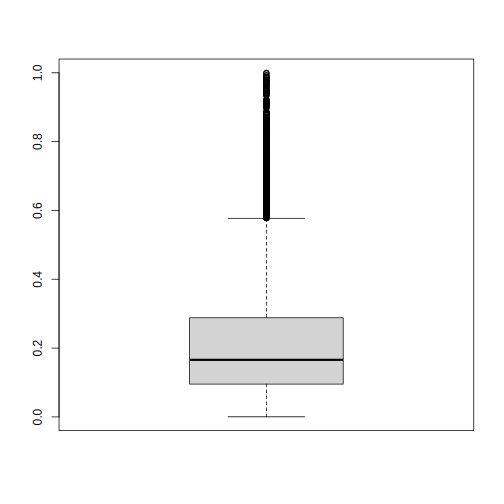
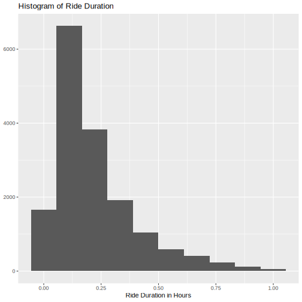

### Ask

The Marketing Department of Cyclistic has asked the Analytics team to deliver actionable insights into the usage characteristics of Cyclistic's customer base to determine how to convert existing Casual users into Membership holders, which represents a more profitable customer demographic.

### Setup


```r
library(tidyverse)
library(lubridate)
```

### Prepare

The data for this product was imported from the company's records in the form of 12 zip compressed CSV files. These were imported from the server using a bash script to gather all files pertaining to calendar year 2022 and stored locally in an rstudio project folder and managed on the teams local server as a Git repository. Only members of the team were given access to the source data. The CSV were created as read-only to maintain the integrity of the source data. After the csv files were reviewed the Zip files were removed from the repository.


```bash
#Import Data from source
#Source URL: https://divvy-tripdata.s3.amazonaws.com/index.html

#!/bin/bash

# Set the base URL for the zip files
base_url="https://divvy-tripdata.s3.amazonaws.com/"


# Iterate through months 1 to 12
for month in {1..12}; do
    # Add leading zero if the month is single digit
    if ((month < 10)); then
        month="0${month}"
    fi

    # Construct the file URL
    file_url="${base_url}2022${month}-divvy-tripdata.zip"

    # Download the file using curl
    curl -O "$file_url"
done
```


The individual datasets were concatenated using the rbind function with the following script:


```r
# Set the directory path where the CSV files are located
directory <- "~/Desktop/gdac_cs_1/source"

# Get a list of all CSV files in the directory
csv_files <- list.files(directory, pattern = "\\.csv$", full.names = TRUE)

# Initialize an empty data frame to store the concatenated data
combined_data <- data.frame()

# Loop through each CSV file and concatenate the data
for (file in csv_files) {
  # Read the CSV file
  data <- read.csv(file)
  
  # Concatenate the data using rbind
  combined_data <- rbind(combined_data, data)
}
```

The complete dataset was was wriiten to the file 2202-all-divvy-tripdata.csv.  The dataset was then assigned to the object df.

```r
df <- read.csv("~/R/gdac_cs_1/source/2022-all-divvy-tripdata.csv")
```


```r
names(df)
```

```
## NULL
```


### Process

Upon inspection of the data the naming conventions were found to be acceptable for the analysis and it was determined that there was no obvious concern regarding bias in the population. The team chose to create new variables to gain clearer insight into the dataset such as trip_duration, day_of_week, day_of_year, and month_of_year. It was determined that observations of `docked_bike` were in need of cleaning as this value was not pertinent to the business question.


```r
df <- df_frac
colnames(df)[1] <- "id"
df$trip_duration <- as.numeric(difftime(df$ended_at, df$started_at, units = "hours"))
df$day_of_week <- wday(df$started_at)
df$day_of_year <- yday(df$started_at)
df$month_of_year <- month(df$started_at)
names(df)
```

```
##  [1] "id"                 "rideable_type"      "started_at"         "ended_at"           "start_station_name" "start_station_id"  
##  [7] "end_station_name"   "end_station_id"     "start_lat"          "start_lng"          "end_lat"            "end_lng"           
## [13] "member_casual"      "trip_duration"      "day_of_week"        "day_of_year"        "month_of_year"
```

An initial summary was run on the numeric variable `trip_duration` to determine the distribution of data across the dataset and generated the following boxplot.


```r
summary(df$trip_duration)
```

```
##      Min.   1st Qu.    Median      Mean   3rd Qu.      Max. 
## 0.0002778 0.0952778 0.1658333 0.2197030 0.2880556 1.0000000
```

```r
boxplot(df$trip_duration)
```



This showed notable outliers above the third Quartile and there should have been no values equal to or less than Zero hours. The following Histogram gave further insight of the trends regarding trip duration. 


```r
df %>%
  filter(!trip_duration > 5,
         !trip_duration <= 0) %>% 
  ggplot(aes(x = trip_duration))+
  geom_histogram(bins = 10)+
  labs(x = "Ride Duration in Hours", y = NULL, title = "Histogram of Ride Duration")
```


Since the vast majority of rides had a ride limit under 1 hour the data was filtered to more accuratly reflect trends including any negative trip value.

```r
df %>%
  filter(trip_duration > 0,
         trip_duration <= 1) %>% 
  ggplot(aes(x = trip_duration))+
  geom_histogram(bins = 10)+
  labs(x = "Ride Duration in Hours", y = NULL, title = "Histogram of Ride Duration")
```


#### Sample

Due to the large nature of the dataset a sample was generated representing approx. .003% of the dataset. This sample represents a 99% Confidence Level and a 1% Margin of Error.


```r
df_frac <- df %>%
  filter(trip_duration > 0,
         trip_duration <= 1) %>%
  sample_frac(.003)
```

Again running a distribution summary of the `trip_duration` variable on the `sample_data` reveals that the sample is statistically significant enough to use in place of the full population going forward with the analysis.


```r
summary(df_frac$trip_duration)
```

```
##      Min.   1st Qu.    Median      Mean   3rd Qu.      Max. 
## 0.0002778 0.0952778 0.1658333 0.2197030 0.2880556 1.0000000
```

Here is the output of the same plot. The number and degree of outliers are significantly reduced, potentially eliminating the need to filter the data further.


```r
df_frac %>%
  ggplot(aes(x = trip_duration))+
  geom_histogram(bins = 10)+
  labs(x = "Ride Duration in Hours", y = NULL, title = "Histogram of Ride Duration")
```


The sample data is saved in order to recall it for future observation.

```r
output_sample_file <- "~/R/gdac_cs_1/source/2022-sample-divvy-tripdata.csv"
write.csv(df_frac, file = output_sample_file, row.names = TRUE)
```

```
## Warning in file(file, ifelse(append, "a", "w")): cannot open file '/home/tlw/R/gdac_cs_1/source/2022-sample-divvy-tripdata.csv':
## No such file or directory
```

```
## Error in file(file, ifelse(append, "a", "w")): cannot open the connection
```

